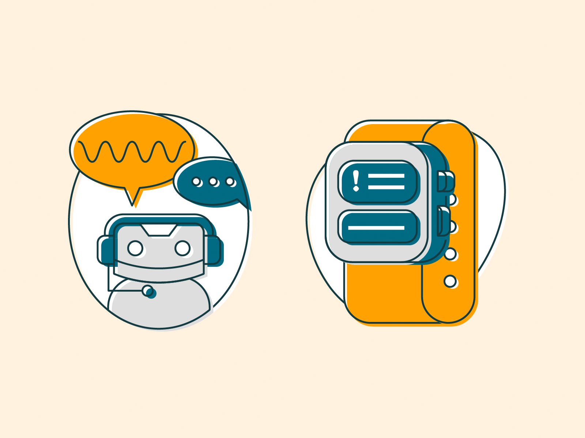

# Prottoy Health

In Bangladesh, many individuals fail to undergo regular medical check-ups, a practice recommended by health experts to maintain a healthy lifestyle. Specifically, it is suggested to have check-ups once a year if over the age of 50, and once every three years for younger, healthy individuals. Unfortunately, this lack of regular health assessments has led to an increase in undetected malignant diseases such as breast cancer and skin cancer.  

Many individuals also hesitate to share unusual symptoms in certain body parts due to stigma or uncertainty about whether to consult a doctor. This hesitation, coupled with inadequate healthcare infrastructure, exacerbates the situation.  

### **Challenges in Healthcare**  
Bangladesh suffers from both a shortage and unequal distribution of healthcare resources. The country has an estimated 3.05 physicians and 1.07 nurses per 10,000 population, which is insufficient to meet the demands of its large population. Consequently, Bangladesh bears a significant burden of diseases that often go undiagnosed until advanced stages.  

### **Prottoy Health: The Solution**  
To address these challenges, **Prottoy Health** is designed as a mobile application that utilizes machine learning and image processing to identify detectable diseases, including breast cancer. The app analyzes symptoms or medical images to provide accurate disease detection and suggests necessary actions based on its analysis.  

### **Key Features**  
- **Early Disease Detection**: Leveraging advanced technologies to detect diseases at an early stage.  
- **Guidance for Users**: Offering recommendations on whether to consult a doctor based on detected symptoms or analysis.  
- **Cost-Effective Solution**: Providing affordable services by partnering with healthcare professionals and hospitals.  

### **Impact**  
An application like Prottoy Health can significantly benefit Bangladesh by addressing gaps in healthcare accessibility and promoting early detection. It empowers individuals with knowledge about their health while alleviating the burden on the healthcare system.  

Prottoy Health is a step toward a healthier future, enabling individuals to take proactive measures in disease prevention and management.

# **Medical Assistant Application with Inclusive Design**  

**Objective:**  
To create a medical assistant application that not only supports users in managing their medical data but also incorporates features to address neurodivergent users' specific needs, ensuring accessibility and inclusivity for all.  

### **Inclusive Features for Neurodivergent Users**  

#### 1. **Tailored Insights for Neurodivergent Conditions**  
- **ADHD and Autism Support:** Recognizes common co-occurring conditions in neurodivergent individuals, offering detailed comparisons to help users monitor changes in symptoms and health.  
- **Condition Awareness:** Provides accessible explanations for conditions like ADHD, autism, and migraines, which are prevalent among neurodivergent individuals.  

#### 2. **Accessible Design**  
- **Simplified UI/UX:** Features clear, minimalistic design elements and customizable navigation for ease of use, especially for individuals with ADHD or sensory sensitivities.  
- **Visual Aids:** Incorporates charts, graphs, and icons for a more intuitive understanding of medical data.  

#### 3. **Gender-Specific Insights**  
- Acknowledges gender-based differences in neurodivergent conditions, addressing the higher prevalence of ADHD and autism in males while accounting for the subtler presentation in females, who are often underdiagnosed.  
- Provides targeted insights and reminders tailored to user demographics, ensuring a more personalized experience.  

#### 4. **Supportive Notifications and Reminders**  
- Regular notifications for routine health check-ups and medication tracking, catering to users who may struggle with memory or organization.  
- Friendly, non-intrusive reminders for users with ADHD or autism to encourage proactive health management.  

### **Impact**  
This application not only bridges the gap in healthcare accessibility in Bangladesh but also addresses a significant need for inclusivity in medical technology. By focusing on neurodivergent-friendly design and personalized insights, it aims to empower all users—neurotypical and neurodivergent alike—to take charge of their health confidently.  

**Potential Use Cases:**  
- Early detection of conditions through regular monitoring and analysis.  
- Empowering rural and non-native speakers with Bangla translations and user-friendly interfaces.  
- Providing neurodivergent individuals with accessible and personalized medical insights to manage their unique health challenges effectively.  

